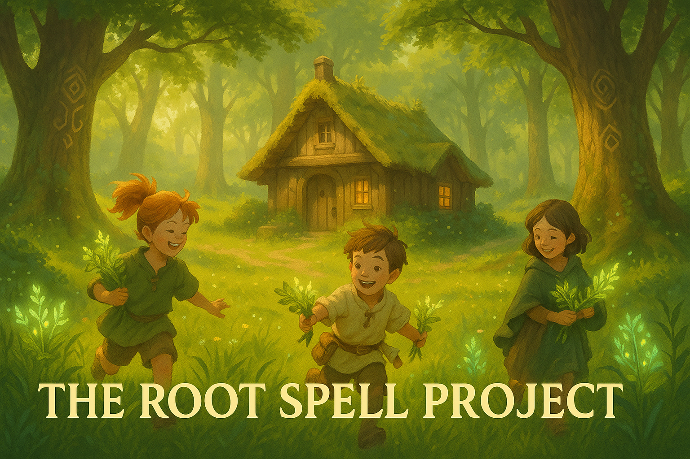

# The Root Spell Project

  

> _"*The world is **full** of **magic**, patiently waiting for our senses to grow **sharper**.*"_
> _-_ Willian B. Yeats

---

## Overview

It operates under a single premise:
**Magic Already Exists.** It's just in the form of science, and people tend to find effort boring.

**The Root Spell Project** is a personal initiative exploring low-level Computer Science. As I study **magic** I'll develop my own, which will be published here as open source projects.

---

## Intent

This space serves as a library of experiments, tools, and ideas, built entirely in **_Go_**.

My intention for The Root Spell Project is to one day have built every tool for my own custom workflow, like my own advanced package manager like brew, and my own collaborative code editing functionalities like replit, but on the terminal.

#### Currently In Development

- [ ] **Crows**
       ‣ _What it does:_ Terminal based chatting platform
       ‣ _Inspired by:_ `me`

#### Future Plans

- [ ] **Korok**
       ‣ _What it does:_ Tracks changes across files
       ‣ _Inspired by:_ `git`

---

## Author

The Root Spell Project is maintained by <a href="https://justin06lee.dev" target="_blank">me</a>, a developer interested in low-level systems programming, and cares a bit too much about their dev environment and workflow.

This is not a company, a studio, or an organization — just a guy with an interest in building things and reinventing the wheel but better(in my completely unbiased opinion).

---

## Contact

For discussion, collaboration, or curiosity:

`justin.leehuiyun@gmail.com`

[The Root Spell Project Github](https://github.com/the-root-spell-project)

---
